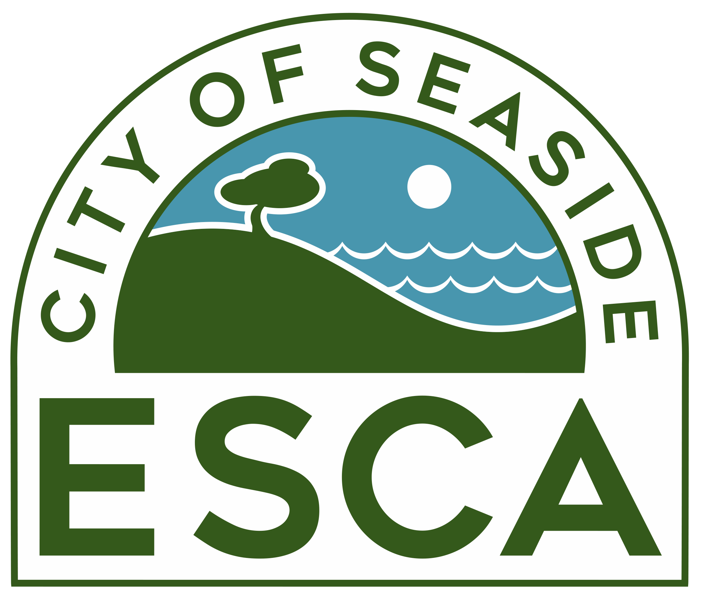

```{r setup, include=FALSE}
knitr::opts_chunk$set(echo = TRUE)
library(fontawesome)
```

This document was developed to support the FORA property transfer audit. The initial list of properties, those transferred to FORA from the Army, came from the fortordsafety.com. In order to update the status of this properties (e.g., ownership and latest deed), the ESCA staff audited this list of parcels to:

  1. Match a Corps of Engineers (COE) parcel number with a Accessor Parcel Number (APN)
  2. Run bulk queries on the identified APNs against ParcelQuest to adquire parcel attributes (e.g., owner, deed, etc.)
  
<br>  
  
<table style = "border: 1px black solid;"><tr><td style = "padding: 10px; text-align: left; background-color: #f5f5f5; font-size: 12px;">
**Note:** The shapes and position of the Army COE parcels are not a perfect match to the County of Monterey's APN parcels. As such, the data collection team had to make qualitative determinations to transform some COE numbers to APN numbers.
</td></tr></table>

<br>

## Disclaimer
  
This document is designed to serve as a visual aid. The views expressed here are not those of the authors, the landowners or any regulatory agency associated with the former Fort Ord. 

<br><hr/>

```{r, echo = FALSE, out.width = "18%", fig.align='center'}

```

<center><small>Proudly made with open source software by [Chris Callaghan](https://github.com/cjcallag), code available on [`r fa('github')`](https://github.com/cjcallag/transfer_audit).</small></center>

